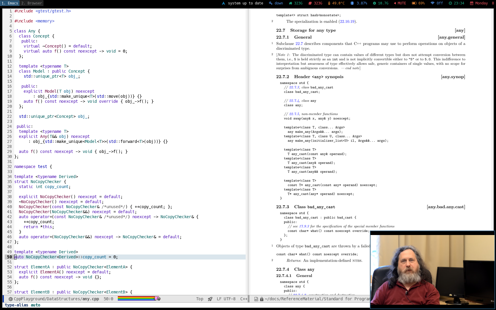

#+title: Arch Linux Dotfiles
#+author: David Álvarez Rosa
#+email: david@alvarezrosa.com
#+language: en

Keyboard-first, minimalist, fast.  Built entirely on free software and
tuned around Emacs-style keybindings.  Battle-tested for nearly a decade
across work and personal machines.

- Emacs :: Editor, terminal, email, agenda, calendar, notes, PDFs,
  images, file manager, RSS/Atom feeds, IRC, and LLM integration.
- i3 Window Manager :: Tiling window management with custom i3-blocks
  and dunst notifications.
- Zsh :: With oh-my-zsh and starship prompt.
- Qutebrowser :: Minimal, keyboard-driven web browsing.
- mpv :: Lightweight media player.
- isync :: Email synchronization.
- xbindkeys / xremap :: Key remapping.

#+html:  

On a fresh Arch Linux machine, optionally export your GPG key
(KeePassXC) to =~/gpg-key.asc=, then run

#+begin_src sh
  curl -fsSL https://raw.githubusercontent.com/david-alvarez-rosa/dotfiles/main/bootstrap.sh | sh
#+end_src

#+html:  

With :heart: by [[https://david.alvarezrosa.com][David Álvarez Rosa]].
